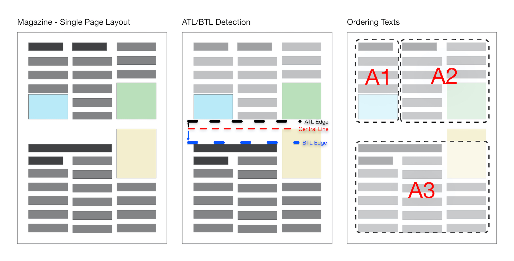
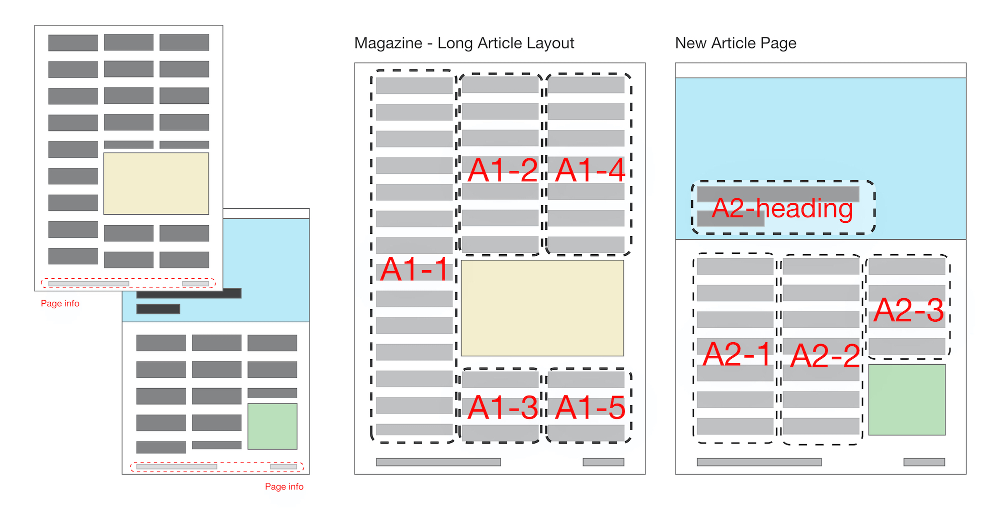

# PDF Magazine Automation

This work is an attempt to get clear text from PDF magazines to provide accessible **content for the visually impaired.**

This script uses rule based approach to determine,

- Beginning of the text
- Un-needed texts like header and page number
- Where to split articles
- Seperate layouts for single page

Also this work is a philosophical approach to understand and simulate conditional behaviours of human. A blog post will be posted. :)

Magazine layouts can be sophisticated and sometimes order of the items can be different. The script looks for a vertical space for the single page & multi article layouts.



Also the script understands the beginning of new article by comparing text sizes. When bigger text is found, the script tries to understand it's title or not.



**Please feel free** to contribute with additional rules. You can open a pull request with your new rule.

# How to Contribute

1. Create a new file as `my_rule.py`
2. Insert all of your seperate rules as seperate funtions which will be called from the main script `pdf.py`
3. Import your script inside `pdf.py` and call it in the proper line.
4. For the standardized code structure you can use this sturucture below. (Or you can suggest a new, better structure.)


```
#####...#####

# RULE: The name of the rule
# Description of what this rule does.

from my_rule import my_awesome_rule

my_awesome_rule(input_items)

#####...#####
```

# Notes

1. This script is using pdfminer which is good at text only pdfs. Magzines contain images. So the loading time can be higher. To increase loading time and reduce processing time, some preprocessing techniques can be applied like ghostscript. 
1. Images can be extracted with ghostscript with the command below. But when this process applied, some of the magazines corrupt. So this technique is not added to the project while it really decreased the processing time as default.
   1. ```gs -o output.pdf -sDEVICE=pdfwrite -dFILTERVECTOR -dFILTERIMAGE input.pdf```
   2. If you want to run after ghost script use like below;
   3. ```gs -o output.pdf -sDEVICE=pdfwrite -dFILTERVECTOR -dFILTERIMAGE input.pdf;python3 pdf.py output.pdf```

2. To convert all pdf magazines use ```for f in *.pdf; do python3 pdf.py "$f"; done```